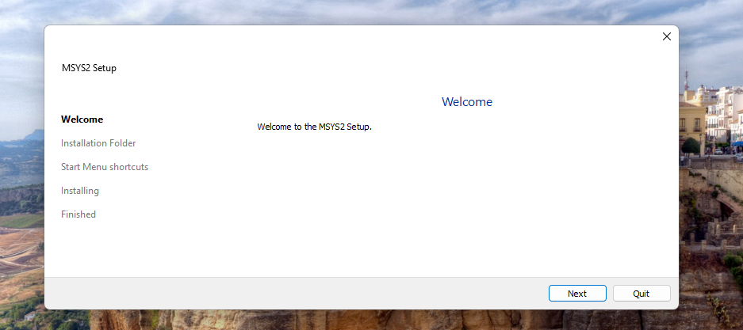

# C++ Podstawy.

Type: Review
Favorite: No

# Jak zainstalować kompilator?

- Kompilator jest potrzeby aby nasze programy w c++ się uruchamiały, zainstalujemy sobie kompilator **G++**
- Pobieramy instalator z https://github.com/msys2/msys2-installer/releases/download/2024-01-13/msys2-x86_64-20240113.exe
- Następnie uruchamiamy go. Pojawia się takie okno:



Klikamy  **Next** lub **Dalej**


Możemy zostawić **domyślny folder instalacji** następnie przechodzimy dalej.


Nic nie zmieniamy tutaj zostawiamy to i idziemy dalej.


Rozpocznie się instalacja kompilatora. Po zakończeniu klikamy dalej i gdy zobaczymy taki ekran.

 


Klikamy finish i kompilator jest praktycznie gotowy do użycia!


Otwiera się powysze okno wklejamy w nie:

```bash
pacman -S --needed base-devel mingw-w64-ucrt-x86_64-toolchain

```


Wyskakuje nam coś takiego klikamy ENTER.


Tutaj też potwierdzamy enterem. Czekamy na pełną instalacje. Pobieranie może trochę zająć max do 5 minut przy tragicznym internecie.


Coś podobnego pojawi się po poprawnej instalacji.

Musimy jeszcze dodać kompilator do zmiennej środowiskowej w pasku wyszukiwania systemu wpisujemy frazę: “zmienne środowiskowe” i wybieramy opcję z panelu sterowania ja mam po angielsku i u  mnie wygląda to tak:


Po otworzeniu się okna klikamy przycisk “zmienne środowiskowe”:


Wybieramy zmienne systemowe “PATH” u mnie jest tego dużo więc musze przescroolować


Zaznaczamy path i klikamy EDIT (lub edytuj)

Wybieramy new lub nowa w nowo otwarym oknie i wpisujemy


W polu tekstowym przy domyslnej instalacji wpisujemy
`C:\msys64\ucrt64\bin`


Zatwierdzamy we wszystkich oknach klikając “OK” i zamykamy 1 okno.

Teraz mamy kompilator gotowy do użycia!

# Testowanie kompilatora i pierwszy program

- Uruchamiamy visual studio code, otwieramy nowy folder i tworzymy w nim plik o nazwie np: “test.cpp”.

```cpp
#include <iostream>

int main() {
    std::cout << "witaj swiecie!";
}
```

Umieszczamy w nim powyższą treść i klikamy F5. 

Vsc poprosi nas o wybranie debugera:


Wybieramy 1 opcje (C++ (GDB/LLDB)

Następnie


Wybieramy kompilator G++.

W zakładce terminal powinno po chwili pojawić się to:


Jeśli widzimy napis witaj w świecie to jesteśmy gotowi do programowania w c++!
